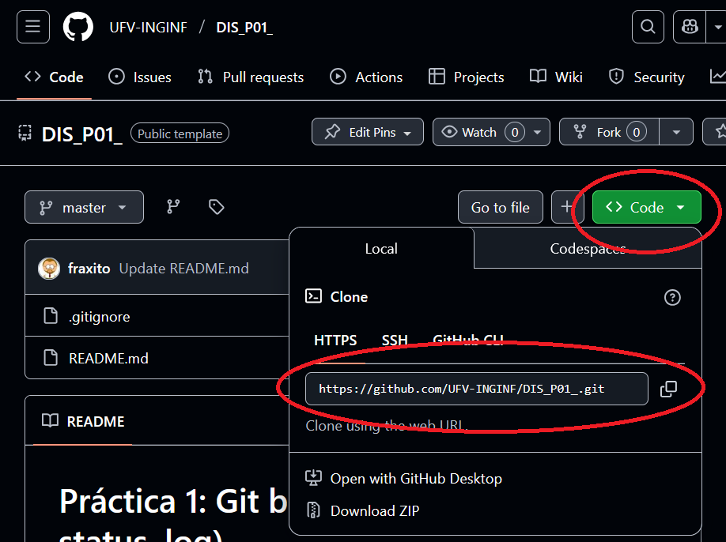

# Práctica 1: Git básico (add, commit, status, log)

## 🎯 Objetivo

Familiarizarse con los comandos básicos de Git trabajando desde el terminal:

- Añadir y modificar archivos
- Hacer commits
- Consultar el estado del repositorio
- Ver el historial de cambios

## 🧪 Instrucciones

1. Acepta la práctica desde GitHub Classroom usando el enlace proporcionado por el profesor.

2. Clona tu repositorio en local con Visual Studio Code:



```bash
git clone https://github.com/ufv-dis-2025/p1-git-basico-TUUSUARIO.git
cd p1-git-basico-TUUSUARIO
```

> También puedes usar `Git: Clone` desde el menú de comandos de Visual Studio Code (`Ctrl + Shift + P`).

3. Abre la carpeta en Visual Studio Code y abre la terminal integrada (`Ctrl + ñ` o Terminal > Nueva Terminal).

4. En la carpeta `tarea/`, abre el archivo `mi_historia.txt` y escribe un pequeño párrafo contando una experiencia personal como informático (elige uno):
   - ¿Cómo aprendiste a programar?
   - ¿Cuál fue tu primer error épico?
   - Un chiste informático

5. Guarda los cambios y realiza tu primer commit:

```bash
git status
git add .
git commit -m "Primera versión de mi historia personal"
```

6. Vuelve a editar el archivo para añadir una segunda anécdota. Luego haz otro commit:

```bash
git add .
git commit -m "Añadida segunda anécdota"
```

7. Usa `git log` para ver el historial de cambios y comprobar que todo ha quedado registrado.

## ✅ Entrega

⚠️ **IMPORTANTE:** Hacer `git commit` solo guarda los cambios en tu ordenador.  
Para que podamos recibir tu trabajo y lo podamos evaluar, **debes subirlo a GitHub** con `git push`: (fíjate bien si tu rama principal se llama main o se llama master)

```bash
git push origin main
```
o si tu rama principal se llama master:
```bash
git push origin master
```